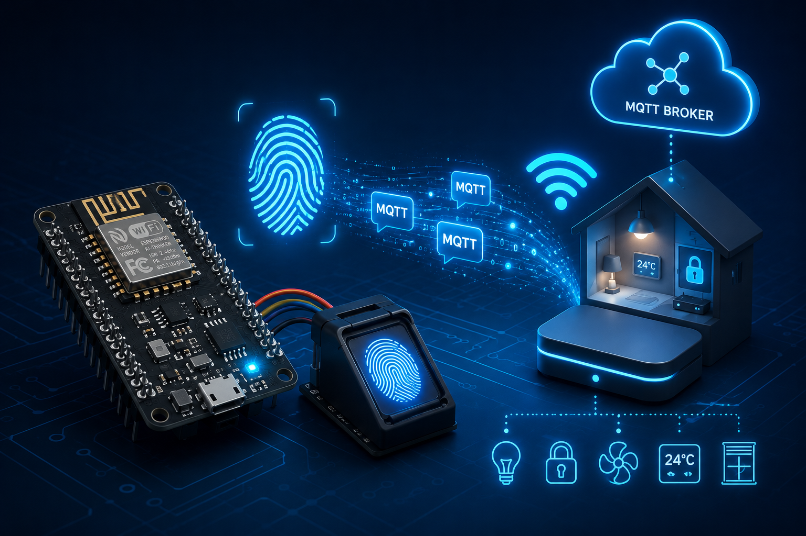

<div align="center">

# 🫆 ESP8266 Fingerprint over MQTT

### A Wi-Fi Fingerprint Access Node — Read / Enrol / Delete, All Controlled over MQTT


[](LICENSE)
[](https://github.com/eahmeddarwish/esp8266-fingerprint-mqtt)


**Built by [Ahmed Darwish](mailto:eahmeddarwish@gmail.com)**

[📖 How it works](#-how-it-works--كيف-يعمل) · [⚠️ Honest Limitations](#-honest-limitations--محدوديات-صادقة) · [🚀 Quick Start](#-quick-start--البدء-السريع) · [⭐ Star on GitHub](https://github.com/eahmeddarwish/esp8266-fingerprint-mqtt) (docs/MODEL_CARD.md)


</div>


---

## 🌍 Overview | نظرة عامة

**[English]**
A Wi-Fi **fingerprint access node** on a Wemos D1 / ESP8266 with an optical
fingerprint sensor. It exposes three modes switched **remotely over MQTT** —
**READING** (scan and publish who matched, with a confidence score, as JSON),
**LEARNING** (enrol a new fingerprint at a given ID), and **DELETE** (remove an
ID). Because everything is published/subscribed over MQTT, a hub like Home
Assistant or Node-RED can react to recognitions and manage enrolment remotely.

**[العربية]**
عقدة **دخولٍ بالبصمة عبر الواي فاي** على Wemos D1 / ESP8266 مع حسّاس بصمةٍ ضوئي.
تقدّم ثلاثة أوضاعٍ تُبدَّل **عن بُعدٍ عبر MQTT**: **القراءة** (مسحٌ ونشر من طابقت
بصمته ودرجة الثقة كـ JSON)، و**التعلّم** (تسجيل بصمةٍ جديدةٍ على رقمٍ محدّد)،
و**الحذف** (إزالة رقم). ولأن كل شيءٍ يُنشَر/يُشترَك عبر MQTT، يستطيع مركزٌ مثل Home
Assistant أو Node-RED التفاعل مع التعرّف وإدارة التسجيل عن بُعد.

---

## 🔐 Security — real secrets removed | إزالة الأسرار الحقيقية

**[English]**
An earlier variant of this code had a **real Wi-Fi password and a real MQTT
token hardcoded**. Those have been **removed** — this repo ships **placeholders
only** (`"Your Wifi SSID"`, `"MQTT Password"`, …), and `.gitignore` blocks a
`secrets.h`. If you used the old version, rotate that Wi-Fi password and MQTT
token at their source.

**[العربية]**
نسخةٌ سابقةٌ من الكود كانت فيها **كلمة سر واي فاي حقيقية وتوكن MQTT حقيقيٌّ مكتوبان
صراحةً**. أُزيلا تمامًا — يحتوي هذا المستودع على **قيمٍ نائبةٍ فقط**، و`.gitignore`
يمنع ملف `secrets.h`. لو استخدمت النسخة القديمة، غيّر كلمة سر الواي فاي وتوكن MQTT
من مصدرهما.

---

## ✨ Key Features | أهم المزايا

| Feature | Description |
|---|---|
| 🫆 **Match → MQTT** | Publishes `{mode,id,state,confidence}` JSON on a match |
| 🎓 **Remote enrolment** | Publish an ID to the learning topic to enrol a finger |
| 🗑️ **Remote delete** | Publish an ID to the delete topic to remove it |
| 🟢 **Availability (LWT)** | Retained `online/offline` via MQTT Last-Will |
| 🧩 **Hub-friendly** | Plugs into Home Assistant / Node-RED over MQTT |
| 🔐 **Placeholders only** | No real credentials in the repo |

---

## 🔬 How it works | كيف يعمل

```
finger ─► sensor ─► ESP8266
   READING  → match → publish {id, state:"Matched", confidence} to /fingerprint/result
   (hub publishes ID to /fingerprint/mode/learning) → enrol → publish "Enrolled"
   (hub publishes ID to /fingerprint/mode/delete)   → delete → publish "Deleted"
   availability: retained "online"/"offline" (MQTT LWT)
```

---

## 🧰 Hardware Used | العتاد المستخدم

| Component | Role |
|---|---|
| Wemos D1 mini / ESP8266 | Wi-Fi MCU |
| Optical fingerprint sensor (R30x, UART) | Biometric input (GPIO12/14) |
| MQTT broker (Mosquitto, etc.) | Messaging backbone |
| 5 V supply | Sensor power |

---

## 🚀 Quick Start | البدء السريع

1. Install libraries: **ESP8266WiFi**, **PubSubClient**, **ArduinoJson**,
   **Adafruit Fingerprint Sensor Library**, **EspSoftwareSerial**.
2. Fill in the placeholders in the config block (Wi-Fi + MQTT).
3. Flash `src/FingerPrintMqtt/FingerPrintMqtt.ino` to the ESP8266.
4. Subscribe to `/fingerprint/result` on your broker; publish an ID to
   `/fingerprint/mode/learning` to enrol, or to `/fingerprint/mode/delete` to
   remove.

---

## ⚙️ MQTT Topics | مواضيع MQTT

| Topic | Direction | Purpose |
|---|---|---|
| `/fingerprint/result` | publish | JSON match/enrol/delete results |
| `/fingerprint/available` | publish (retained) | `online` / `offline` (LWT) |
| `/fingerprint/mode/reading` | subscribe | switch to reading mode |
| `/fingerprint/mode/learning` | subscribe | enrol at the payload ID |
| `/fingerprint/mode/delete` | subscribe | delete the payload ID |

---

## 📁 Project Structure | هيكل المشروع

```
.
├── src/
│   └── FingerPrintMqtt/
│       └── FingerPrintMqtt.ino
├── .gitignore
└── LICENSE
```

---

## ⚠️ Honest Limitations | محدوديات صادقة

**[English]**
- **MQTT is unauthenticated at the app layer.** Anyone who can publish to the
  mode topics can enrol/delete — put the broker behind TLS + ACLs.
- **Fingerprint templates live on the sensor**, capped at the module's capacity
  (often 127/1000); no external backup here.
- **No local access decision.** This node reports matches; the *door/relay*
  logic lives on the hub side (by design).
- **ESP8266 SoftwareSerial** to the sensor is fine at 57600 but sensitive to
  timing under heavy Wi-Fi load.

**[العربية]**
- **MQTT بلا مصادقةٍ على مستوى التطبيق**: أي جهةٍ تستطيع النشر لمواضيع الأوضاع
  تُسجّل/تحذف — ضع الوسيط خلف TLS وقوائم ACL.
- **قوالب البصمة على الحسّاس** بحدّ سعته (غالبًا 127/1000)، بلا نسخةٍ احتياطية هنا.
- **بلا قرار وصولٍ محلي**: العقدة تُبلّغ عن التطابق، ومنطق الباب/الريلاي على المركز
  (بالتصميم).
- **SoftwareSerial على ESP8266** جيدٌ عند 57600 لكنه حسّاسٌ للتوقيت تحت حمل واي فاي.

---

## 🗺️ Roadmap | خطط التطوير

- [x] **Phase 1** — Reading/learning/delete over MQTT + JSON results + LWT *(current)*
- [ ] **Phase 2** — Home Assistant MQTT-discovery auto-config
- [ ] **Phase 3** — TLS + per-client ACLs
- [ ] **Phase 4** — Local relay/door fallback when the broker is down

---

## 🙏 Credits | إسنادات

Uses the open-source **Adafruit Fingerprint**, **PubSubClient**, and
**ArduinoJson** libraries, credited to their authors.

---

## 👤 Author | المطور

<div align="center">

**Ahmed Darwish**

*Electrical & Computer Engineer | Python · Arduino · Raspberry Pi · AI/ML*

[](mailto:eahmeddarwish@gmail.com)
[](https://github.com/eahmeddarwish)

</div>

---

## 📄 License

Licensed under the **MIT License** — see [LICENSE](LICENSE).
The third-party libraries keep their own licenses.

---

<div align="center">

⭐ **If this project is useful, please give it a star on GitHub!** ⭐

*Made with ❤️ by Ahmed Darwish*

</div>
